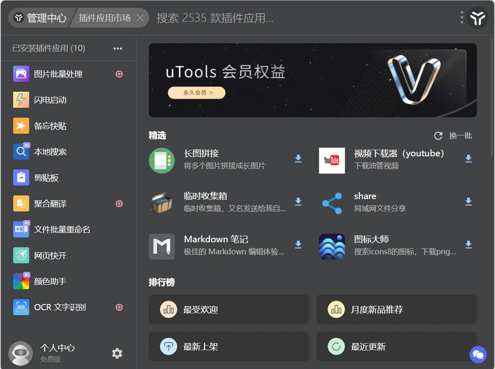
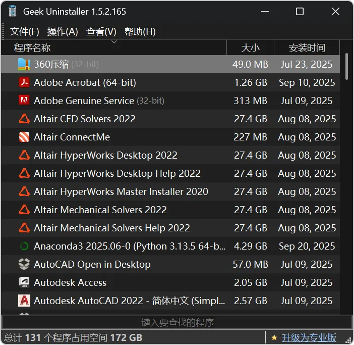
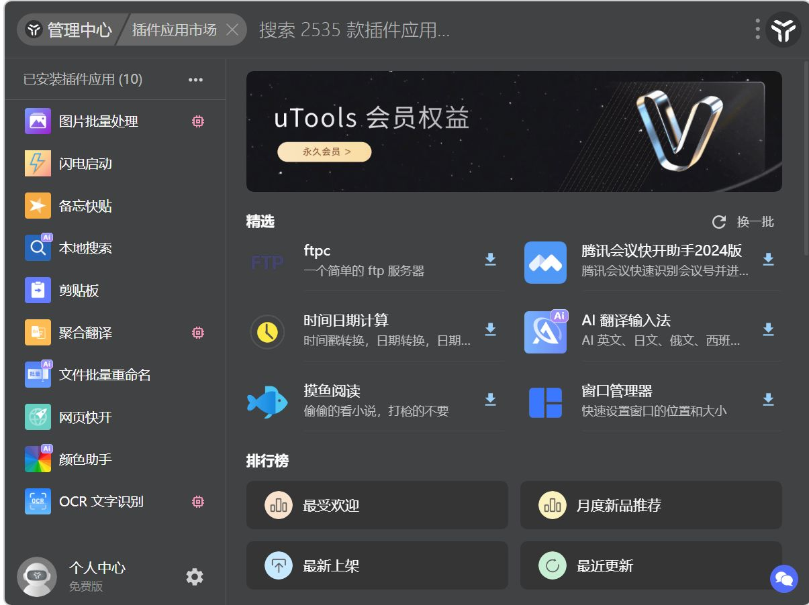

## 软件的推荐
俗话说：预成其事，必先利其器。博主最近也买了新电脑然后重新装了相关软件，也又发现了一批好用的软件，但是博主也发现了使用过程中应该注意的一些原则以及注意事项。所以在这里记录一下使用的一些软件以及使用过程中的原则或是建议以供参考。

1. **奥卡姆剃刀原则**

所谓奥卡姆剃刀，简单来说就是“如无必要，勿增实体”，如果你没有对这个软件的功能的需求，请不要安装这个软件。电脑里有一些经典但用不到的软件只会占用你的内存，除此之外别无任何用处。如果你觉得你“可能”会用到某些软件，请在用到的时候再下载安装它。

2. **美化原则**

对于所有软件或终端的美化如果会降低效率或影响工作，请及时舍弃。例如博主见过太多在编程界面添加好看背景的操作了，但是自己尝试了一下发现会分散注意力，所以不适合本人。而一些提高工作效率的美化，例如oh my posh的终端美化，博主尝试后发现其会提供传统终端没有的功能，所以博主选择了保留使用。

3. **慎重 all in one原则**

很多软件（例如obsidian或zotero）都具有庞大的插件市场，这些插件往往涉及各种方面。我们有时会想把所有可能用到的插件都装上，从而玩出各种花里胡哨的操作。同时我们需要思考：装插件以及使用插件的时间和精力是否可能会高过原本“笨拙”的方法或操作，如果这个问题回答的时候有疑问，我们就需要重新考虑学习这个软件或插件的必要性。

***读前须知***：本帖仅给出截止至2025年9月前，博主认为好用的一些软件与使用经验，但不代表它是最好用的或完全正确的。同时也不对您在您计算机上所作的任何更改负责，在下载相关软件之前，您最好备份相关的数据以避免未知错误（虽然博主使用时没有问题）。

### 小工具类型
[uTools](https://www.u-tools.cn/)：一个插件市场，可以在电脑上方便快捷启动一些功能，
推荐安装：网页快开、截图识别+翻译、finding、图片批量处理

*uTools的插件市场界面，提供了丰富的功能扩展*

keyviz或keycastOW：显示键盘以及鼠标操作，录屏时可以使用
::github{repo="mulaRahul/keyviz"}
::github{repo="allrobot/KeyCastOW_chinese"}
[PixPin](https://pixpin.cn/)：截图工具，支持长截图与动态截图，可以参考[PixPin使用文档 ](https://pixpin.cn/docs/start/quick-start)

[DeskPins](https://deskpins.en.softonic.com/)：窗口置顶工具，可以将任意窗口置为顶层

[Directory Opus](https://directory-opus.com/)或[OneCommander](https://www.onecommander.com/)：增强的资源管理器工具，可以快捷管理文件夹
dirctory opus可能会在部分电脑上右键二级文件夹时会卡死，但整体操作较为简单

[ImTip](https://imtip.aardio.com/)或者ImpuTip：在输入的时候可以提示当前输入法状态的中英大写，比较适合盲打
::github{repo="aardio/ImTip"}
::github{repo="abgox/InputTip"}

[Everything](https://www.voidtools.com/zh-cn/)：比系统搜索强大的多的搜索软件，非常快

[Stardock Groupy](https://www.stardock.com/products/groupy/)或[Office Tab](https://www.extendoffice.com/product/office-tab.html)：窗口管理软件，前者可以管理所有窗口，后者主要是对Office三件套进行窗口管理

[Geek Uninstaller](https://geekuninstaller.com/)：卸载软件，可以顺带清理残留文件与注册表

*博主的Geekuninstaller*

ContextMenuManager：鼠标右键管理软件，防止右键无用选项挤占空间
::github{repo="BluePointLilac/ContextMenuManager"}
### 软件类型
[Bandicam](https://www.bandicam.cn/)：高清录屏软件

格式工厂：主要进行视频类的格式转换

[Obsidian](https://obsidian.md/)或[Notion](https://www.notion.com/)等笔记软件：使用md格式的笔记软件

[Zotero](https://www.zotero.org/)或[EndNote](https://endnote.com/zh/)等文献管理软件：进行文献管理以及分析

此外，博主也建议如果你希望提高自己的打字效率，除了盲打之外可以从输入法进行改进，例如可以尝试双拼（或五笔）。博主这里对双拼进行介绍。双拼输入法是一种将声母与韵母映射到键盘上的输入法，通过汉字的声母韵母组成，稳定按两次即可打出一个汉字。
maki的双拼视频
下面通过一个例子来说明双拼的优势，这是双拼（小鹤双拼）与全拼的按键对比：

汉字：这是一个用来对比双拼与全拼的句子。

全拼：zhe/shi/yi/ge/yong/lai/dui/bi/shuang/pin/yu/quan/pin/de/ju/zi

双拼：ve/ui/yi/ge/ys/ld/dv/bi/ul/pb/yu/qr/pb/de/ju/zi

可以看出，双拼可以有效减少键盘按键次数，同时使打字更有节奏感。学习方法也很简单，将所有打字媒介输入方式换成双拼后，手机屏保设置为双拼键位图，适应半个月到一个月即可。

博主需要提醒的一点是，工具以及软件只是属于“道-法-术-器”中的“器”阶段，也就是只是工具。虽然也有对于工作流以及管理系统的探索（例如lifeos人生管理系统或moc、para管理系统），但是“术”阶段博主还是建议参考别人的工作流从而尝试建立自己的工作流，毕竟各位的工作习惯不同，工作方法也不同。

最后，往往一个软件可以有成百上千个插件，而插件之间往往又互相迭代学习，部分功能相互重合。所以一个功能有很多插件都可以实现。这时候，我们可以回头看博主的第一条准则——

***如无必要，勿增实体。***